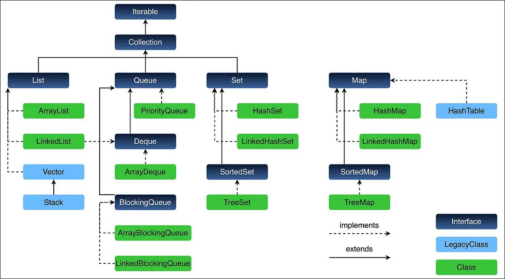

# Java Collections — Interview Notes

## Table of Contents

| # | Question |
|---|---|
| 1 | [What is the Java Collections Framework?](#1-what-is-the-java-collections-framework) |
| 2 | [What is the benefit of Generics in Collections?](#2-what-is-the-benefit-of-generics-in-collections) |
| 3 | [What are all the key interfaces and classes in Collections?](#3-what-are-all-the-key-interfaces-and-classes-in-collections) |
| 4 | [Why does Collection not extend Cloneable and Serializable?](#4-why-does-collection-not-extend-cloneable-and-serializable) |
| 5 | [What is the difference between Ordered and Sorted?](#5-what-is-the-difference-between-ordered-and-sorted) |
| 6 | [What are the different List implementations?](#6-what-are-the-different-list-implementations) |
| 7 | [What are the Map collection views?](#7-what-are-the-map-collection-views) |
| 8 | [What are concurrent collection classes?](#8-what-are-concurrent-collection-classes) |
| 9 | [How do you create a synchronized collection?](#9-how-do-you-create-a-synchronized-collection) |
| 10 | [How do you synchronize an ArrayList?](#10-how-do-you-synchronize-an-arraylist) |
| 11 | [Why does Iterator not have an add() method?](#11-why-does-iterator-not-have-an-add-method) |
| 12 | [What is EnumMap and when to use it?](#12-what-is-enummap-and-when-to-use-it) |
| 13 | [What is IdentityHashMap and when to use it?](#13-what-is-identityhashmap-and-when-to-use-it) |
| 14 | [What are the different ways to iterate over a List?](#14-what-are-the-different-ways-to-iterate-over-a-list) |
| 15 | [How do you avoid ConcurrentModificationException?](#15-how-do-you-avoid-concurrentmodificationexception) |
| 16 | [Which collection classes provide random access?](#16-which-collection-classes-provide-random-access) |
| 17 | [How do you sort a List of objects?](#17-how-do-you-sort-a-list-of-objects) |
| 18 | [How do you make a collection unmodifiable?](#18-how-do-you-make-a-collection-unmodifiable) |
| 19 | [What tree does TreeMap use internally?](#19-what-tree-does-treemap-use-internally) |
| 20 | [Best Practices](#20-best-practices) |

---

## 1. What is the Java Collections Framework?

A unified architecture for storing and manipulating groups of objects. Introduced in Java 1.2.

Three parts:
- **Interfaces** — abstract types like `List`, `Set`, `Map`
- **Implementations** — concrete classes like `ArrayList`, `HashMap`
- **Algorithms** — static utility methods in `Collections` class

---

## 2. What is the benefit of Generics in Collections?

Generics add **compile-time type safety** — you catch type errors at compile time, not at runtime.

```java
// Without generics — compiles but crashes at runtime
List list = new ArrayList();
list.add("hello");
Integer i = (Integer) list.get(0); // ClassCastException at runtime

// With generics — compile-time error, no cast needed
List<String> list = new ArrayList<>();
list.add("hello");
String s = list.get(0); // no cast needed
// list.add(123);        // compile error — caught early
```

---

## 3. What are all the key interfaces and classes in Collections?



### Core Interfaces

| Interface | Description |
|---|---|
| `Collection` | Root of the hierarchy |
| `List` | Ordered, allows duplicates |
| `Set` | No duplicates |
| `Queue` | FIFO processing |
| `Deque` | Double-ended queue |
| `Map` | Key-value pairs (not a Collection) |
| `SortedSet` / `SortedMap` | Sorted by natural order or comparator |
| `NavigableSet` / `NavigableMap` | Sorted + navigation methods |

### Key Implementations

| Class | Backed By | Notes |
|---|---|---|
| `ArrayList` | Dynamic array | Fast random access |
| `LinkedList` | Doubly linked list | Fast insert/delete, implements Deque |
| `HashSet` | Hash table | No order |
| `LinkedHashSet` | Hash table + linked list | Insertion order |
| `TreeSet` | Red-black tree | Sorted |
| `HashMap` | Hash table | No order |
| `LinkedHashMap` | Hash table + linked list | Insertion order |
| `TreeMap` | Red-black tree | Sorted by key |
| `PriorityQueue` | Binary heap | Natural or custom order |
| `ArrayDeque` | Dynamic array | Preferred over Stack |

### Legacy (avoid in new code)

| Class | Notes |
|---|---|
| `Vector` | Synchronized ArrayList |
| `Stack` | Extends Vector, use ArrayDeque instead |
| `Hashtable` | Synchronized HashMap, use ConcurrentHashMap instead |

---

## 4. Why does Collection not extend Cloneable and Serializable?

Not all collection implementations need or want cloning or serialization.

- Forcing it on the interface would violate the **Interface Segregation Principle**
- Individual classes implement `Serializable` on their own — `ArrayList`, `HashMap`, `TreeMap` all do
- Cloning behavior in inheritance hierarchies is complex and error-prone

**Gotcha**: Just because `Collection` doesn't extend `Serializable` doesn't mean collections can't be serialized — most standard implementations can be.

---

## 5. What is the difference between Ordered and Sorted?

| | Ordered | Sorted |
|---|---|---|
| Meaning | Maintains insertion order | Elements arranged by value |
| Examples | `ArrayList`, `LinkedHashMap` | `TreeSet`, `TreeMap` |
| Order basis | When you added it | Natural order or Comparator |

```java
// Ordered — insertion order preserved
Map<String, Integer> ordered = new LinkedHashMap<>();
ordered.put("banana", 1); ordered.put("apple", 2); ordered.put("cherry", 3);
System.out.println(ordered.keySet()); // [banana, apple, cherry]

// Sorted — alphabetical order
Set<String> sorted = new TreeSet<>();
sorted.add("banana"); sorted.add("apple"); sorted.add("cherry");
System.out.println(sorted); // [apple, banana, cherry]
```

---

## 6. What are the different List implementations?

| List | Backed By | Random Access | Thread-safe | Use When |
|---|---|---|---|---|
| `ArrayList` | Dynamic array | O(1) | No | Default choice, read-heavy |
| `LinkedList` | Doubly linked list | O(n) | No | Frequent insert/delete |
| `Vector` | Dynamic array | O(1) | Yes (slow) | Legacy only |
| `Stack` | Extends Vector | O(1) | Yes (slow) | Legacy — use `ArrayDeque` |
| `CopyOnWriteArrayList` | Array (copy-on-write) | O(1) | Yes | Read-heavy, rare writes |

```java
// ArrayList — fast get
List<String> list = new ArrayList<>();
list.add("a"); list.add("b");
list.get(0); // O(1)

// LinkedList — fast add at head/tail
LinkedList<String> linked = new LinkedList<>();
linked.addFirst("a"); // O(1)
linked.addLast("b");  // O(1)

// CopyOnWriteArrayList — safe concurrent reads
List<String> safe = new CopyOnWriteArrayList<>();
safe.add("a");
for (String s : safe) {
    safe.add("b"); // no ConcurrentModificationException
}
```

---

## 7. What are the Map collection views?

Three views — all are **backed by the map** (changes reflect both ways):

```java
Map<String, Integer> map = new HashMap<>();
map.put("alice", 95); map.put("bob", 80); map.put("charlie", 90);

// 1. keySet() — Set of keys
map.keySet().remove("bob"); // also removes from map

// 2. values() — Collection of values (can have duplicates)
map.values().contains(95); // true

// 3. entrySet() — most efficient for full iteration
for (Map.Entry<String, Integer> e : map.entrySet()) {
    System.out.println(e.getKey() + " = " + e.getValue());
    e.setValue(e.getValue() + 5); // can update value in-place
}

// removeIf via views
map.values().removeIf(score -> score < 85); // removes bob
map.keySet().removeIf(name -> name.startsWith("c")); // removes charlie
```

| View | Returns | Duplicates | Can Add | Can Remove |
|---|---|---|---|---|
| `keySet()` | `Set` | No | No | Yes |
| `values()` | `Collection` | Yes | No | Yes |
| `entrySet()` | `Set<Map.Entry>` | No | No | Yes |

---

## 8. What are concurrent collection classes?

Thread-safe collections from `java.util.concurrent` — better than `synchronized` wrappers.

| Class | Interface | Blocking | Use Case |
|---|---|---|---|
| `ConcurrentHashMap` | `Map` | No | High-concurrency key-value store |
| `CopyOnWriteArrayList` | `List` | No | Read-heavy list |
| `CopyOnWriteArraySet` | `Set` | No | Read-heavy set |
| `ConcurrentSkipListMap` | `NavigableMap` | No | Sorted concurrent map |
| `ConcurrentSkipListSet` | `NavigableSet` | No | Sorted concurrent set |
| `ArrayBlockingQueue` | `BlockingQueue` | Yes | Bounded producer-consumer |
| `LinkedBlockingQueue` | `BlockingQueue` | Yes | Unbounded producer-consumer |
| `ConcurrentLinkedQueue` | `Queue` | No | Non-blocking high-throughput queue |

```java
// ConcurrentHashMap — lock-free reads, node-level writes
Map<String, Integer> map = new ConcurrentHashMap<>();
map.putIfAbsent("key", 1);   // atomic
map.replace("key", 1, 2);    // atomic compare-and-replace

// BlockingQueue — producer-consumer
BlockingQueue<String> queue = new ArrayBlockingQueue<>(10);
queue.put("task");           // blocks if full
String task = queue.take();  // blocks if empty
```

---

## 9. How do you create a synchronized collection?

```java
// Wrap any collection with Collections.synchronizedXxx()
List<String>   syncList      = Collections.synchronizedList(new ArrayList<>());
Set<Integer>   syncSet       = Collections.synchronizedSet(new HashSet<>());
Map<String, Integer> syncMap = Collections.synchronizedMap(new HashMap<>());
SortedMap<String, Integer> syncSortedMap = Collections.synchronizedSortedMap(new TreeMap<>());

// Gotcha: iteration must be manually synchronized
synchronized (syncList) {
    for (String item : syncList) { System.out.println(item); }
}
```

**Prefer concurrent collections** over synchronized wrappers for better performance:

| Instead of | Use |
|---|---|
| `synchronizedMap(new HashMap<>())` | `ConcurrentHashMap` |
| `synchronizedList(new ArrayList<>())` | `CopyOnWriteArrayList` |
| `synchronizedSortedMap(new TreeMap<>())` | `ConcurrentSkipListMap` |

---

## 10. How do you synchronize an ArrayList?

Three options:

```java
// Option 1 — synchronizedList (manual sync for iteration)
List<String> list = Collections.synchronizedList(new ArrayList<>());
synchronized (list) {
    for (String s : list) { System.out.println(s); }
}

// Option 2 — CopyOnWriteArrayList (preferred for read-heavy)
List<String> list = new CopyOnWriteArrayList<>();
for (String s : list) { list.add("new"); } // safe, no exception

// Option 3 — explicit lock (fine-grained control)
private final List<String> list = new ArrayList<>();
private final Object lock = new Object();

public void add(String s)    { synchronized (lock) { list.add(s); } }
public String get(int i)     { synchronized (lock) { return list.get(i); } }
```

| Approach | Read Perf | Write Perf | Notes |
|---|---|---|---|
| `synchronizedList` | Moderate | Moderate | Manual sync for iteration |
| `CopyOnWriteArrayList` | High | Low | Best for read-heavy |
| Explicit lock | Depends | Depends | Fine-grained control |

---

## 11. Why does Iterator not have an add() method?

Iterator's purpose is **traversal only** — adding during iteration causes unpredictable positioning and potential `ConcurrentModificationException`.

Use `ListIterator` when you need to add during iteration (List only):

```java
List<String> list = new ArrayList<>(Arrays.asList("first", "last"));
ListIterator<String> it = list.listIterator();
it.next();           // move to "first"
it.add("middle");    // inserts after current position
System.out.println(list); // [first, middle, last]
```

| Feature | `Iterator` | `ListIterator` |
|---|---|---|
| Direction | Forward only | Both directions |
| `add()` | No | Yes |
| `set()` | No | Yes |
| Index access | No | Yes |
| Works with | All Collections | List only |

---

## 12. What is EnumMap and when to use it?

A `Map` implementation where **keys must be enum constants**. Backed by an array — uses the enum ordinal as the index. No hashing needed.

```java
enum Day { MON, TUE, WED, THU, FRI, SAT, SUN }

Map<Day, String> schedule = new EnumMap<>(Day.class);
schedule.put(Day.MON, "Work");
schedule.put(Day.SAT, "Hiking");

System.out.println(schedule.get(Day.MON)); // Work
// Iterates in enum declaration order: MON, TUE, WED...
```

- O(1) for all operations — direct array index lookup
- More memory-efficient than `HashMap` for enum keys
- No null keys allowed
- Not thread-safe

**Use when**: keys are always from a known enum type — state machines, config maps, day/month lookups.

---

## 13. What is IdentityHashMap and when to use it?

Compares keys using `==` (reference equality) instead of `.equals()`.

```java
String a = new String("hello");
String b = new String("hello");

Map<String, Integer> hashMap = new HashMap<>();
hashMap.put(a, 1); hashMap.put(b, 2);
System.out.println(hashMap.size()); // 1 — a.equals(b), b overwrites a

Map<String, Integer> identityMap = new IdentityHashMap<>();
identityMap.put(a, 1); identityMap.put(b, 2);
System.out.println(identityMap.size()); // 2 — a != b (different references)
```

| | `HashMap` | `IdentityHashMap` |
|---|---|---|
| Key equality | `.equals()` | `==` |
| Hashing | `.hashCode()` | `System.identityHashCode()` |
| Use case | General purpose | Object graph traversal, serialization, deep clone tracking |

**Gotcha**: Not suitable for `String` keys or any value-based comparison — two `"hello"` literals may or may not be the same reference depending on interning.

---

## 14. What are the different ways to iterate over a List?

```java
List<String> names = new ArrayList<>(Arrays.asList("Alice", "Bob", "Charlie"));

// 1. for-each — simplest, no index, no modification
for (String name : names) { System.out.println(name); }

// 2. Iterator — safe removal during iteration
Iterator<String> it = names.iterator();
while (it.hasNext()) {
    if (it.next().equals("Bob")) it.remove(); // safe
}

// 3. ListIterator — bidirectional, add/set during iteration
ListIterator<String> lit = names.listIterator();
while (lit.hasNext()) {
    if (lit.next().equals("Bob")) lit.add("David");
}

// 4. index-based for — when you need the index
for (int i = 0; i < names.size(); i++) {
    System.out.println(i + ": " + names.get(i));
}

// 5. forEach (Java 8) — concise
names.forEach(System.out::println);

// 6. Stream (Java 8) — filter/transform
names.stream().filter(n -> n.startsWith("A")).forEach(System.out::println);
```

---

## 15. How do you avoid ConcurrentModificationException?

Thrown when a collection is structurally modified during iteration (outside the iterator).

```java
List<String> names = new ArrayList<>(Arrays.asList("Alice", "Bob", "Charlie"));

// Option 1 — iterator.remove() (safe single-thread removal)
Iterator<String> it = names.iterator();
while (it.hasNext()) {
    if (it.next().equals("Bob")) it.remove();
}

// Option 2 — removeIf (Java 8, cleanest)
names.removeIf(name -> name.equals("Bob"));

// Option 3 — collect to new list via Stream
List<String> filtered = names.stream()
    .filter(n -> !n.equals("Bob"))
    .collect(Collectors.toList());

// Option 4 — CopyOnWriteArrayList (concurrent safe)
List<String> safe = new CopyOnWriteArrayList<>(names);
for (String name : safe) {
    if (name.equals("Bob")) safe.remove(name); // no exception
}
```

| Method | Thread-safe | Notes |
|---|---|---|
| `iterator.remove()` | Single thread | Classic safe removal |
| `removeIf()` | Single thread | Cleanest Java 8 option |
| Stream filter | Single thread | Creates new collection |
| `CopyOnWriteArrayList` | Multi-thread | Expensive writes |

---

## 16. Which collection classes provide random access?

Random access = O(1) element access by index.

| Collection | Random Access | Why |
|---|---|---|
| `ArrayList` | Yes | Array-backed |
| `Vector` | Yes | Array-backed |
| `CopyOnWriteArrayList` | Yes | Array-backed |
| `LinkedList` | No | Must traverse nodes — O(n) |
| `HashSet` / `TreeSet` | No | No index concept |

Classes that support random access implement the `RandomAccess` marker interface. Algorithms can check this to choose the most efficient traversal:

```java
public static <T> void process(List<T> list) {
    if (list instanceof RandomAccess) {
        for (int i = 0; i < list.size(); i++) { process(list.get(i)); } // O(1) per get
    } else {
        for (T item : list) { process(item); } // sequential — better for LinkedList
    }
}
```

---

## 17. How do you sort a List of objects?

```java
// 1. Natural order — class implements Comparable
public class Person implements Comparable<Person> {
    public int compareTo(Person other) {
        return Integer.compare(this.age, other.age); // sort by age
    }
}
Collections.sort(people); // uses compareTo

// 2. Custom order — Comparator
people.sort(Comparator.comparing(Person::getName));                    // by name
people.sort(Comparator.comparingInt(Person::getAge).reversed());       // by age desc
people.sort(Comparator.comparing(Person::getName)
            .thenComparingInt(Person::getAge));                        // multi-field

// 3. Stream — returns new sorted list
List<Person> sorted = people.stream()
    .sorted(Comparator.comparing(Person::getName))
    .collect(Collectors.toList());
```

| Method | Modifies original | Time |
|---|---|---|
| `Collections.sort()` | Yes | O(n log n) |
| `list.sort()` | Yes | O(n log n) |
| `stream().sorted()` | No (new list) | O(n log n) |

All use **TimSort** (merge sort + insertion sort hybrid) — stable sort.

---

## 18. How do you make a collection unmodifiable?

```java
// Collections.unmodifiableXxx — wraps existing collection
List<String> list = new ArrayList<>(Arrays.asList("a", "b"));
List<String> unmod = Collections.unmodifiableList(list);
// unmod.add("c"); // UnsupportedOperationException

// Gotcha: original can still be modified — unmod reflects the change
list.add("c");
System.out.println(unmod); // [a, b, c]

// Java 9+ List.of / Set.of / Map.of — truly immutable
List<String> immutable = List.of("a", "b", "c");
// immutable.add("d"); // UnsupportedOperationException
// list is also not modifiable through original reference — no original exists
```

| Approach | Truly Immutable | Java Version |
|---|---|---|
| `Collections.unmodifiableList()` | No — original can change | All |
| `List.of()` / `Set.of()` / `Map.of()` | Yes | Java 9+ |
| `Collections.singletonList()` | Yes | All |

---

## 19. What tree does TreeMap use internally?

**Red-Black Tree** — a self-balancing binary search tree.

Rules:
- Every node is red or black
- Root is always black
- No red node has a red child
- Every path from root to leaf has the same number of black nodes

This guarantees O(log n) for all operations even in the worst case.

```java
TreeMap<Integer, String> map = new TreeMap<>();
map.put(10, "ten"); map.put(5, "five"); map.put(15, "fifteen");

// Navigation methods — unique to TreeMap
map.lowerKey(10);    // greatest key < 10  → 5
map.higherKey(10);   // smallest key > 10  → 15
map.floorKey(10);    // greatest key ≤ 10  → 10
map.ceilingKey(10);  // smallest key ≥ 10  → 10

// Range views
map.subMap(5, 15);   // keys from 5 (inclusive) to 15 (exclusive)
map.headMap(10);     // keys < 10
map.tailMap(10);     // keys ≥ 10
```

| Operation | Time |
|---|---|
| `get` / `put` / `remove` | O(log n) |
| `firstKey` / `lastKey` | O(log n) |
| `subMap` / `headMap` / `tailMap` | O(log n) |

**Gotcha**: `TreeMap` does not allow null keys (natural ordering calls `compareTo` on null → `NullPointerException`). Null values are allowed.

---

## 20. Best Practices

### Choose the right collection

| Need | Use |
|---|---|
| Fast lookup by key | `HashMap` |
| Sorted keys | `TreeMap` |
| Insertion-ordered keys | `LinkedHashMap` |
| Fast random access | `ArrayList` |
| Frequent insert/delete at ends | `ArrayDeque` |
| No duplicates | `HashSet` |
| Sorted unique elements | `TreeSet` |
| Thread-safe map | `ConcurrentHashMap` |
| Thread-safe read-heavy list | `CopyOnWriteArrayList` |

### Key rules

```java
// Program to interface, not implementation
List<String> list = new ArrayList<>();   // not ArrayList<String> list

// Use generics — always
List<String> names = new ArrayList<>();  // not raw List

// Set initial capacity when size is known
Map<String, User> map = new HashMap<>(1000); // avoids rehashing

// Return empty collections, not null
return Collections.emptyList(); // not return null

// Safe removal during iteration
names.removeIf(n -> n.isEmpty()); // not remove inside for-each

// Implement equals() and hashCode() for objects used as keys
// Without them, HashMap/HashSet will not work correctly
```
