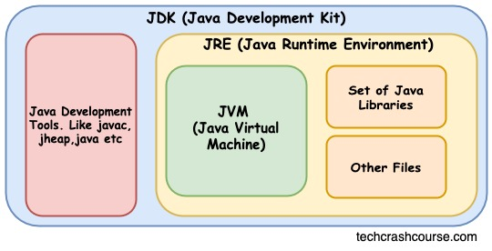
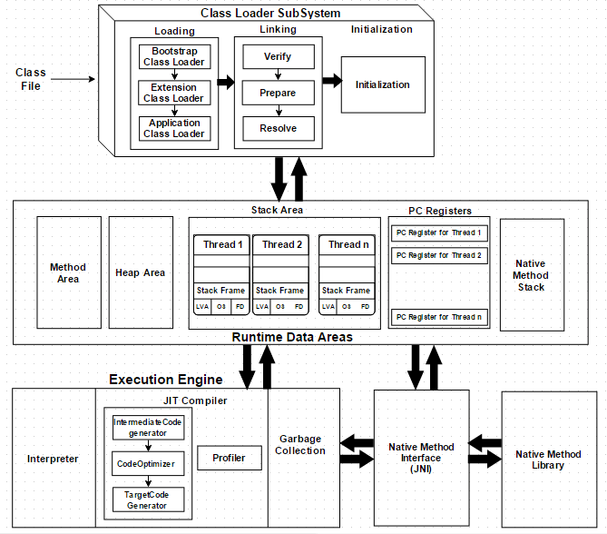

# JVM Architecture & Execution Flow - Comprehensive Study Notes

## Table of Contents
1. [What is JVM?](#what-is-jvm)
2. [JVM Architecture Components](#jvm-architecture-components)
3. [Java Program Execution Flow](#java-program-execution-flow)
4. [Class Loader Subsystem](#class-loader-subsystem)
5. [Runtime Data Areas](#runtime-data-areas)
6. [Execution Engine](#execution-engine)
7. [Key Concepts & Comparisons](#key-concepts--comparisons)

---

## What is JVM?

**JVM (Java Virtual Machine)** is an abstract computing machine that enables the "Write Once, Run Anywhere" principle by converting platform-independent bytecode into platform-dependent machine code.

**Key Points:**
- Not a physical machine, but a specification + implementation
- Provides runtime environment for Java bytecode
- Acts as intermediary between code and OS/CPU
---

## Benefits of JVM Architecture

| Benefit | How It Works | Value |
|---|---|---|
| **Portability (WORA)** | Same bytecode runs everywhere | Write once, deploy anywhere |
| **Performance** | JIT compiles hot code to machine code | Near-native speed for production code |
| **Security** | Bytecode verification, sandboxing | Prevents malicious/invalid code execution |
| **Memory Safety** | Automatic GC, bounds checking | No buffer overflows or memory leaks |
| **Multithreading** | Per-thread stack & PC register | Safe concurrent execution |
| **Dynamic Loading** | Classes loaded on-demand | Lower startup memory usage |
---

## Java Program Execution Flow

```
MyProgram.java (source code)
    ↓ [javac compiler]
    .class file (bytecode - platform independent)
    ↓ [JVM Class Loader]
    Loaded in Method Area (verified & validated)
    ↓ [Execution Engine]
    Machine Code (platform dependent)
    ↓ [OS + CPU]
    Program Execution
```
<!-- C:\Users\Dell\Documents\anil-vn\learn-Java\JVM-internals\JDK_JRE_JVM.jpg -->

 
 | Feature                    | **JDK**                                               | **JRE**                                   | **JVM**                                                    |
| -------------------------- | ----------------------------------------------------- | ----------------------------------------- | ---------------------------------------------------------- |
| **Full Form**              | Java Development Kit                                  | Java Runtime Environment                  | Java Virtual Machine                                       |
| **Meaning**                | JDK is used to develop Java applications and applets. | JRE is used to run Java applications.     | JVM provides runtime environment to execute Java bytecode. |
| **Purpose**                | Development of Java programs.                         | Running Java programs.                    | Executing compiled Java code.                              |
| **Platform Dependency**    | Platform-dependent                                    | Platform-dependent                        | Platform-independent (bytecode runs anywhere with JVM).    |
| **Implementation Formula** | **JDK = JRE + Development Tools**                     | **JRE = JVM + Libraries**                 | JVM is part of JRE.                                        |
| **Contains**               | JRE + tools like compiler, debugger, archiver.        | JVM + class libraries + supporting files. | Runtime execution engine only.                             |
| **Tools Included**         | Yes (javac, jar, javadoc, debugger etc.)              | No development tools.                     | No development tools.                                      |
| **Main Role**              | Writing and building Java programs.                   | Running Java programs.                    | Converting bytecode into machine code.                     |
| **Used By**                | Developers                                            | Users and developers                      | Used internally by JRE                                     |


### JVM vs JRE vs JDK

| Component | Includes | Purpose |
|---|---|---|
| **JVM** | Bytecode executor | Runtime execution |
| **JRE** | JVM + libraries | Run Java programs |
| **JDK** | JRE + compiler + tools | Develop Java programs |
---
<br/>
<br/>

## Key Terminologies

| Term | Definition | Category |
|------|------------|----------|
| Source Code | Human-readable high-level code (.java file) | Input |
| Bytecode | Platform-independent intermediate code (.class file) | Intermediate |
| Machine Code | CPU-specific binary instructions | Output |
| High-Level Language | Languages closer to human language (Java, Python) | Language Type |
| Low-Level Language | Languages closer to hardware (Assembly, Machine Code) | Language Type |
| Hotspot | Frequently executed code sections | Performance |
| JNI | Java Native Interface for C/C++ integration | Interoperability |


---

## JVM Architecture Components



## Complete Java Program Execution Flow

| Step | Phase                  | Input               | Process                                                      | Output                               | Purpose / Description                                 |
| ---- | ---------------------- | ------------------- | ------------------------------------------------------------ | ------------------------------------ | ----------------------------------------------------- |
| 1    | Write Code             | Human logic         | Developer writes Java code                                   | `.java` file                         | High-level human-readable source code                 |
| 2    | Compile                | `.java` file        | `javac` compiler converts source code                        | `.class` file (bytecode)             | Platform-independent intermediate bytecode            |
| 3    | Class Loading          | `.class` file       | Bootstrap, Extension, Application Class Loaders load classes | Classes loaded into JVM memory       | JVM loads required classes into memory                |
| 4    | Linking - Verification | Loaded classes      | Bytecode Verifier checks validity and security               | Verified classes                     | Ensures bytecode is not altered or invalid            |
| 5    | Linking - Preparation  | Verified classes    | JVM allocates memory for static variables                    | Default initialized static variables | Static variables get default values                   |
| 6    | Linking - Resolution   | Symbolic references | JVM converts symbolic references into direct references      | Memory references                    | Method/variable references mapped to memory locations |
| 7    | Initialization         | Prepared classes    | Static variables and static blocks execute                   | Initialized classes                  | Actual values assigned to static variables            |
| 8    | Execution Engine       | Bytecode            | Interpreter + JIT Compiler execute bytecode                  | Machine code                         | Platform-dependent low-level instructions             |
| 9    | Runtime Management     | Running program     | JVM manages Heap, Stack, GC, Threads                         | Optimized execution                  | Memory management and performance optimization        |
| 10   | Termination            | Program end         | JVM shutdown                                                 | Clean state                          | Memory cleanup and resource release                   |

---

## Class Loader Types

| Class Loader             | Parent    | Loads From                | Examples                          |
| ------------------------ | --------- | ------------------------- | --------------------------------- |
| Bootstrap Class Loader   | None      | `<JAVA_HOME>/jre/lib`     | `java.lang.*`, `java.util.*`      |
| Extension Class Loader   | Bootstrap | `<JAVA_HOME>/jre/lib/ext` | `javax.crypto.*`, `javax.swing.*` |
| Application Class Loader | Extension | Project Classpath         | User-defined classes              |

---

## Linking Sub-Phases

| Sub-Phase    | Purpose                                             | Example                                 |
| ------------ | --------------------------------------------------- | --------------------------------------- |
| Verification | Ensures bytecode validity and security              | Checks stack overflow/underflow         |
| Preparation  | Allocates memory for static variables               | `static int x` gets default value `0`   |
| Resolution   | Converts symbolic references into direct references | `System.out.println()` → memory address |

---

## Execution Engine Components

| Component        | Purpose                                                    |
| ---------------- | ---------------------------------------------------------- |
| Interpreter      | Executes bytecode line by line                             |
| JIT Compiler     | Converts frequently used bytecode into native machine code |
| JNI              | Allows Java to interact with native languages like C/C++   |
| Native Libraries | Uses OS-specific libraries like `.dll` or `.so`            |

---

## Complete JVM Flow

```text id="c8p4x1"
.java
   ↓
javac Compiler
   ↓
.class (Bytecode)
   ↓
Class Loader Subsystem
   ↓
Loading
   ↓
Linking
   ├── Verification
   ├── Preparation
   └── Resolution
   ↓
Initialization
   ↓
Execution Engine
   ├── Interpreter
   ├── JIT Compiler
   ├── JNI
   └── Native Libraries
   ↓
Machine Code
   ↓
Program Execution
```
---
## Important Point

| Type                | Platform Independent? |
| ------------------- | --------------------- |
| `.java` source code | Yes                   |
| `.class` bytecode   | Yes                   |
| Machine code        | No                    |
---

## Important Interview Points

- `.java` → source code
- `.class` → bytecode
- Bytecode is platform independent
- JVM is platform dependent
- Class Loader loads classes into memory
- Linking contains:-
    -  Verification
    -  Preparation
    -  Resolution
- Initialization executes static blocks
- JVM uses both Interpreter and JIT Compiler
- JIT improves performance
- Garbage Collector removes unused objects
- JNI connects Java with native code

<br/><br/><br/>


## Runtime Data Areas

### Memory Layout

```
┌──────────────────────────────────────────┐
│  JVM Memory (Heap) - Shared              │
├──────────────────────────────────────────┤
│  Method Area                             │
│  • Class metadata, static variables      │
│  • Method bytecode, constants            │
├──────────────────────────────────────────┤
│  Heap Area                               │
│  • All object instances                  │
│  • Instance variables                    │
│  ★ Managed by Garbage Collector          │
├──────────────────────────────────────────┤
│  Per-Thread Memory                       │
│  ├─ Stack Area                           │
│  │  • Local variables, method frames     │
│  │  • Intermediate calculations          │
│  ├─ PC Register                          │
│  │  • Current instruction address        │
│  └─ Native Method Stack                  │
│     • Native code execution              │
└──────────────────────────────────────────┘
``` 

### Detailed Comparison

| Area | Scope | Thread Shared? | Lifetime | GC? | Use |
|---|---|---|---|---|---|
| **Method Area** | Class-level | Yes (1 per JVM) | JVM lifetime | No | Store class definitions |
| **Heap** | Object-level | Yes (1 per JVM) | Object lifetime | **Yes** | Store objects |
| **Stack** | Method-level | No (per thread) | Method lifetime | No | Store local variables |
| **PC Register** | Instruction-level | No (per thread) | Thread lifetime | No | Track execution |
| **Native Stack** | Native code | No (per thread) | Thread lifetime | No | Support C/C++ calls |

### Stack Frame Example

```
When method is called:
┌────────────────────────┐
│ Stack Frame (method X) │
├────────────────────────┤
│ Local Variables        │  ← method parameters, local vars
├────────────────────────┤
│ Operand Stack          │  ← intermediate results
├────────────────────────┤
│ Dynamic Linking        │  ← runtime constant pool refs
└────────────────────────┘
Frame destroyed when method returns
```

---


### Garbage Collection Process

```
1. MARK phase
   ├─ Start from GC roots (threads, static refs)
   └─ Traverse object graph, mark reachable objects

2. SWEEP phase
   ├─ Scan entire heap
   └─ Free unmarked (unreachable) objects

3. COMPACT phase (optional)
   ├─ Move surviving objects together
   └─ Reduce memory fragmentation
```

---

## Key Concepts & Comparisons

### Code Transformation Levels

<!-- ```
┌─────────────────────┐
│   Source Code       │  .java file
│  (Human language)   │  Java, C++, Python
└──────────┬──────────┘
       │ [Compiler - javac]
       ↓
┌─────────────────────┐
│   Bytecode          │  .class file
│ (Platform-neutral)  │  Works on any JVM
└──────────┬──────────┘
       │ [JVM Execution Engine]
       ↓
┌─────────────────────┐
│   Machine Code      │  Binary instructions
│ (Platform-specific) │  CPU understands
└─────────────────────┘
``` -->


### Stack vs Heap

| Feature | Stack | Heap |
|---|---|---|
| **Speed** | Faster (LIFO) | Slower (GC managed) |
| **Memory Size** | Smaller (MB range) | Larger (GB range) |
| **Thread Access** | Thread-local | Shared by all threads |
| **Allocation** | Automatic (LIFO) | Automatic (GC) |
| **Exception** | StackOverflowError | OutOfMemoryError |
| **Example** | `int x = 5;` | `new Student()` |

---


## Interview Quick Reference

**Q: What happens when you run `java MyClass`?**
1. JVM starts
2. Application Class Loader finds MyClass.class
3. Class loaded → linked → initialized
4. main() method invoked
5. Execution Engine executes bytecode
6. GC cleans unused objects
7. JVM shuts down

**Q: Why is Java platform-independent but JVM is not?**
- Bytecode is platform-independent (same everywhere)
- JVM implementation is platform-specific (different for Windows, Linux, Mac)
- JVM abstracts platform differences

**Q: Stack vs Heap memory?**
- **Stack**: Thread-local, fixed size, fast allocation, automatic cleanup
- **Heap**: Shared, dynamic size, slower allocation, GC cleanup

---

