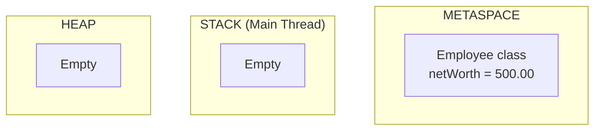
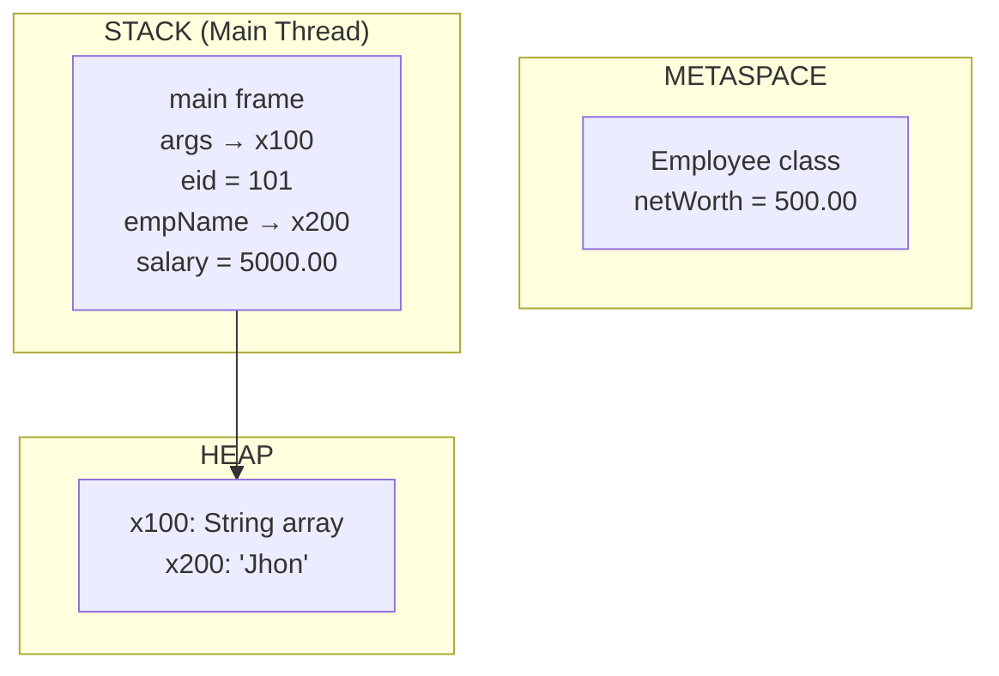
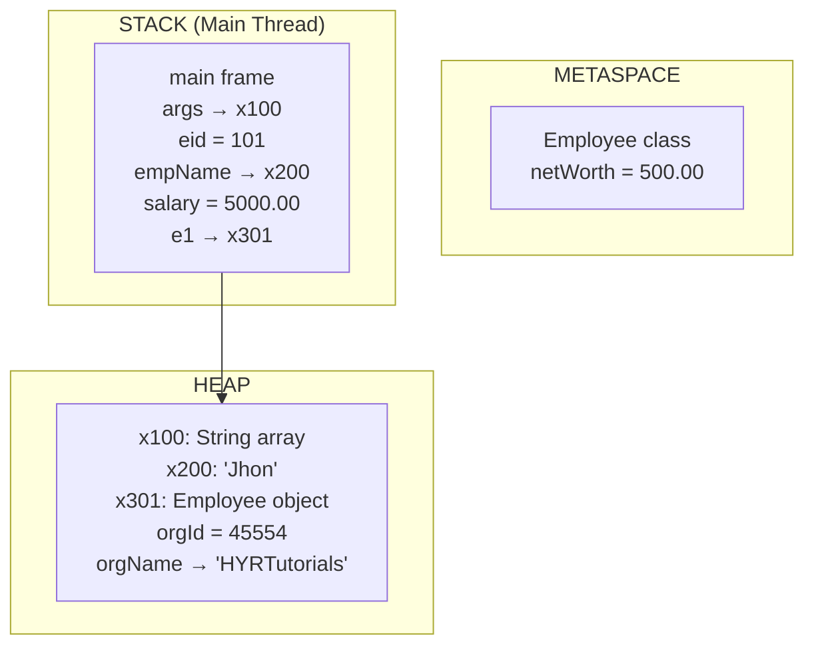
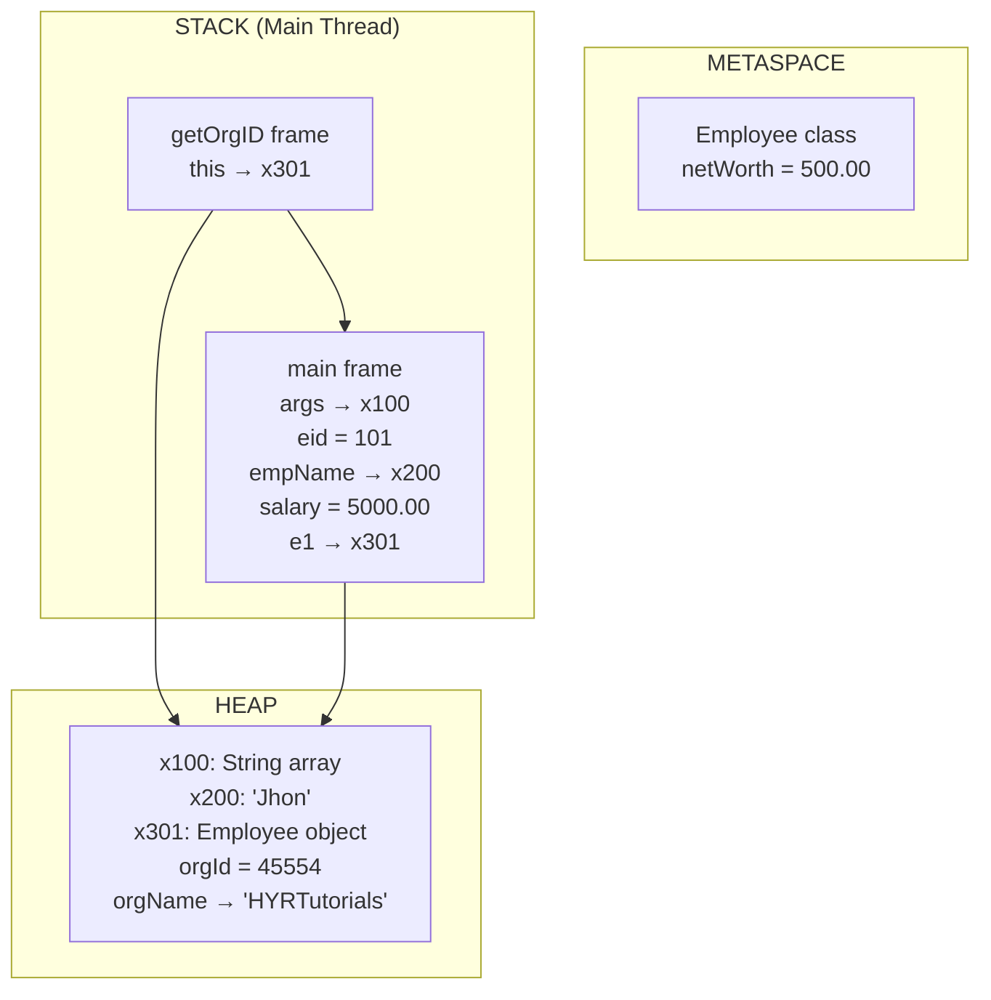

# JVM Memory Allocation - Beginner's Guide

Let me explain JVM memory using just **Heap** and **Stack** - the two most important areas you need to understand first.

## Mental Model

Think of JVM memory like this:
- **Stack**: Where method calls and local variables live (one stack per thread)
- **Heap**: Where objects live
- **String Pool**: Special area in heap for string literals
- **Metaspace/Class Area**: Where static variables and class info live

## Memory Areas Mapping

| Data Type | Memory Location | Example |
|-----------|----------------|---------|
| Local variables (primitives) | Stack | `int eid = 101` |
| Object references | Stack | `Employee e1` |
| Objects | Heap | `new Employee()` |
| String literals | String Pool (in Heap) | `"HYRTutorials"` |
| Static variables | Metaspace/Class Area | `static double netWorth` |

## Example Code

```java
class Employee {

    int orgId = 45554;
    String orgName = "HYRTutorials";
    String ceo = "Yadagiri";
    int noOfDepts = 2;

    static double netWorth = 500.00;

    public int getOrgID() {
        return orgId;
    }

    public static double getNetWorth() {
        return netWorth;
    }

    public void deleteEmployee(int empID) {
    }

    public static void main(String[] args) {

        int eid = 101;
        String empName = "Jhon";
        double salary = 5000.00;

        Employee e1 = new Employee();
        e1.getOrgID();

        System.out.println(Employee.getNetWorth());

        Employee e2 = new Employee();
        e2.deleteEmployee(101);
    }
}
```

## Step-by-Step Execution

### Step 1 - Class Loading
When JVM starts, it loads the Employee class.

**METASPACE/CLASS AREA:**
```
Employee class info
netWorth = 500.00 (static variable)
```

**STACK:** Empty  
**HEAP:** Empty

---

### Step 2 - Thread Creation
JVM creates main thread with its own stack.

**STACK (Main Thread):** Empty  
**HEAP:** Empty  
**METASPACE:** Employee class + netWorth = 500.00

---

### Step 3 - main() Frame Creation
When main() method starts, JVM pushes a new frame onto stack.

**STACK (Main Thread):**
```
┌─────────────────┐
│ main() frame    │
│ args -> x100    │ (reference to String array)
└─────────────────┘
```

**HEAP:**
```
x100: String[] array (for args)
```

---

### Step 4 - Local Variables Creation
As we execute main() method line by line:

```java
int eid = 101;
String empName = "Jhon";
double salary = 5000.00;
```

**STACK (Main Thread):**
```
┌─────────────────┐
│ main() frame    │
│ args -> x100    │
│ eid = 101       │ (primitive in stack)
│ empName -> x200 │ (reference to string)
│ salary = 5000.00│ (primitive in stack)
└─────────────────┘
```

**HEAP:**
```
x100: String[] array
x200: "Jhon" (in String Pool)
```

**STRING POOL:**
```
"Jhon"
"HYRTutorials" 
"Yadagiri"
```

---

### Step 5 - Object Creation
```java
Employee e1 = new Employee();
```

**STACK (Main Thread):**
```
┌─────────────────┐
│ main() frame    │
│ args -> x100    │
│ eid = 101       │
│ empName -> x200 │
│ salary = 5000.00│
│ e1 -> x301      │ (reference to Employee object)
└─────────────────┘
```

**HEAP:**
```
x100: String[] array
x200: "Jhon"
x301: Employee object {
        orgId = 45554
        orgName -> x202 ("HYRTutorials")
        ceo -> x203 ("Yadagiri") 
        noOfDepts = 2
      }
```

---

### Step 6 - Method Call (Push Frame)
```java
e1.getOrgID();
```

JVM pushes new frame for getOrgID() method:

**STACK (Main Thread):**
```
┌─────────────────┐ ← Top of stack
│ getOrgID() frame│
│ this -> x301    │ (implicit reference to e1)
├─────────────────┤
│ main() frame    │
│ args -> x100    │
│ eid = 101       │
│ empName -> x200 │
│ salary = 5000.00│
│ e1 -> x301      │
└─────────────────┘
```

**HEAP:** Same as before

---

### Step 7 - Method Return (Pop Frame)
When getOrgID() returns 45554:

**STACK (Main Thread):**
```
┌─────────────────┐ ← getOrgID() frame REMOVED
│ main() frame    │
│ args -> x100    │
│ eid = 101       │
│ empName -> x200 │
│ salary = 5000.00│
│ e1 -> x301      │
└─────────────────┘
```

The return value (45554) is passed back to main() but not stored anywhere.

---

### Step 8 - Static Method Call
```java
System.out.println(Employee.getNetWorth());
```

**STACK (Main Thread):**
```
┌─────────────────┐ ← Top
│ getNetWorth()   │ (static method - no 'this')
├─────────────────┤
│ main() frame    │
│ args -> x100    │
│ eid = 101       │
│ empName -> x200 │
│ salary = 5000.00│
│ e1 -> x301      │
└─────────────────┘
```

Returns 500.00 from Metaspace, then frame is popped.

---

### Step 9 - Second Object Creation
```java
Employee e2 = new Employee();
```

**STACK (Main Thread):**
```
┌─────────────────┐
│ main() frame    │
│ args -> x100    │
│ eid = 101       │
│ empName -> x200 │
│ salary = 5000.00│
│ e1 -> x301      │
│ e2 -> x401      │ (new reference)
└─────────────────┘
```

**HEAP:**
```
x100: String[] array
x200: "Jhon"
x301: Employee object #1
x401: Employee object #2 {
        orgId = 45554
        orgName -> x202 ("HYRTutorials")
        ceo -> x203 ("Yadagiri")
        noOfDepts = 2
      }
```

---

### Step 10 - Method Call with Parameter
```java
e2.deleteEmployee(101);
```

**STACK (Main Thread):**
```
┌─────────────────┐ ← Top
│ deleteEmployee()│
│ this -> x401    │
│ empID = 101     │ (parameter copied from eid)
├─────────────────┤
│ main() frame    │
│ args -> x100    │
│ eid = 101       │
│ empName -> x200 │
│ salary = 5000.00│
│ e1 -> x301      │
│ e2 -> x401      │
└─────────────────┘
```

Method does nothing, so frame is popped immediately.

---

### Step 11 - Program End
When main() ends, its frame is popped:

**STACK (Main Thread):** Empty  
**HEAP:** Objects remain (until Garbage Collector runs)  
**METASPACE:** Class info remains

## Key Concepts

### LIFO Behavior
Stack works like a stack of plates:
- **Push**: Add new frame on top when method is called
- **Pop**: Remove top frame when method returns
- **Last In, First Out**: Most recent method call finishes first

### Stack vs Frame
- **Stack**: The entire memory area for one thread
- **Frame**: One section of stack for one method call
- Each method call creates a new frame
- Frames are destroyed when method returns

### What Gets Destroyed
When a method returns:
- ✅ **Frame is destroyed**: All local variables and parameters gone
- ✅ **References are destroyed**: But objects they pointed to remain in heap
- ❌ **Objects stay in heap**: Until Garbage Collector removes them
- ❌ **Static variables stay**: They live in Metaspace

## Mermaid Diagrams

### Initial State


### After main() starts


### After new Employee()


### During method call


### Final state
```mermaid
graph TB
    subgraph "METASPACE"
        A[Employee class<br/>netWorth = 500.00]
    end
    
    subgraph "STACK (Main Thread)"
        B[Empty<br/>(main ended)]
    end
    
    subgraph "HEAP"
        C[x100: String array<br/>x200: 'Jhon'<br/>x301: Employee object #1<br/>x401: Employee object #2<br/>(waiting for GC)]
    end
```

## Summary

That's the foundation! Once you understand Stack and Heap clearly, we can explore Garbage Collection, Method Area details, and other JVM internals.

### Quick Reference
- **Stack**: Method calls, local variables, references (LIFO)
- **Heap**: Objects and arrays
- **String Pool**: String literals (part of heap)
- **Metaspace**: Class info and static variables
- **Frame**: One method's data in stack
- **Reference**: Points from stack to heap objects